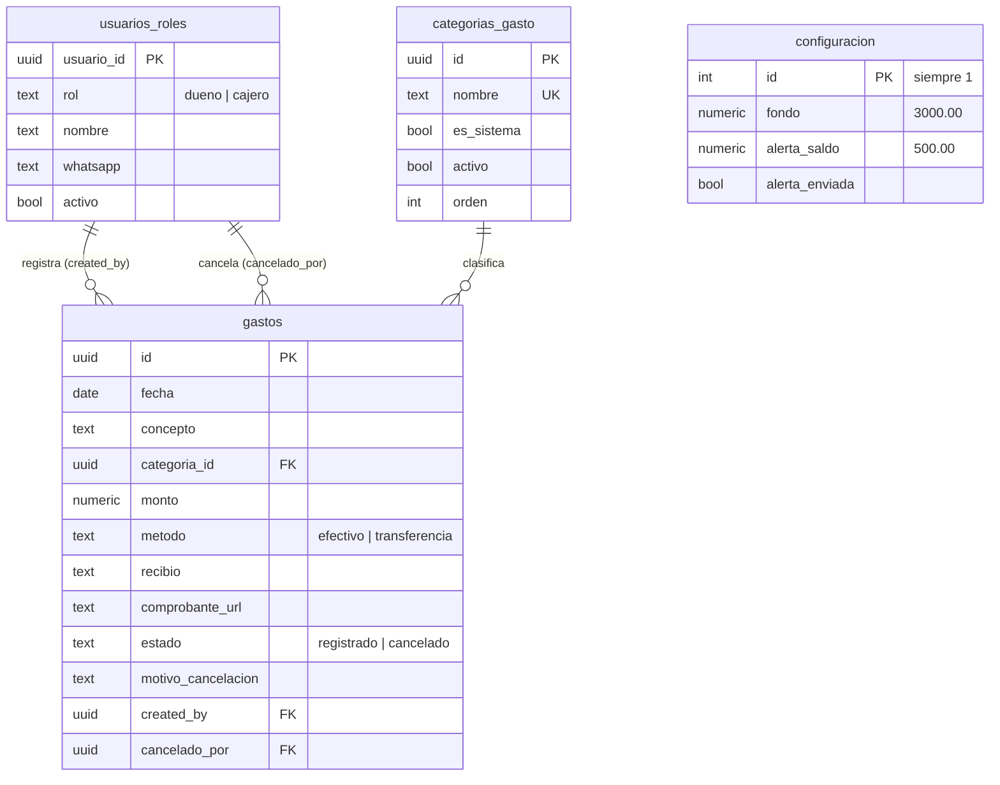

# Diagrama entidad-relación

```mermaid
erDiagram
  usuarios_roles ||--o{ gastos : "registra (created_by)"
  usuarios_roles ||--o{ gastos : "cancela (cancelado_por)"
  categorias_gasto ||--o{ gastos : "clasifica"

  usuarios_roles {
    uuid usuario_id PK
    text rol "dueno | cajero"
    text nombre
    text whatsapp
    bool activo
  }
  configuracion {
    int id PK "siempre 1"
    numeric fondo "3000.00"
    numeric alerta_saldo "500.00"
    bool alerta_enviada
  }
  categorias_gasto {
    uuid id PK
    text nombre UK
    bool es_sistema
    bool activo
    int orden
  }
  gastos {
    uuid id PK
    date fecha
    text concepto
    uuid categoria_id FK
    numeric monto
    text metodo "efectivo | transferencia"
    text recibio
    text comprobante_url
    text estado "registrado | cancelado"
    text motivo_cancelacion
    uuid created_by FK
    uuid cancelado_por FK
  }
```
